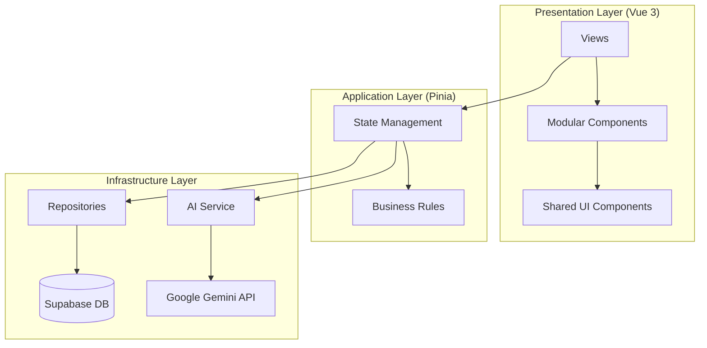

#  Selty CRM | AI-Driven Sales Intelligence

<div align="center">


**A premium, high-performance CRM architecture designed for hyper-efficient lead management and AI-assisted sales conversion.**

[Explore Demo](https://your-demo-link.com) · [Report Bug](https://github.com/your-username/SeltyApp/issues) · [Request Feature](https://github.com/your-username/SeltyApp/issues)

</div>

---

## 🌟 Vision & Impact

Selty isn't just another CRM. It's a technical demonstration of **Modern Frontend Engineering**. It solves the friction of traditional sales workflows by integrating **Google's Gemini AI** directly into a modular, event-driven architecture.

### Key Engineering Highlights:
- **🧠 AI Sales Brain**: Context-aware outreach generation that adapts to lead status and interaction history.
- **⚡ Performance First**: Zero-overhead state management with Pinia and ultra-fast styling with Tailwind CSS v4.
- **🏗️ Industrial-Grade Architecture**: Built on **Modular Domain-Driven Design (DDD)**, ensuring the codebase remains maintainable as the feature set grows.
- **💎 Premium UX**: Glassmorphism UI, micro-animations, and a standardized transition system.

---

## 🧠 The AI Strategy: Sales Brain Intelligence

Unlike traditional CRMs that act as passive databases, **Selty** implements an active intelligence layer. The "Sales Brain" isn't just a wrapper for a LLM; it's a context-aware engine designed to optimize the sales funnel.

### Why AI?
Sales representatives often suffer from **decision fatigue** and **context switching**. The Sales Brain eliminates this by:
- **Context Injection**: Every AI request is hydrated with the lead's complete profile (Sectors, attempt history, current status, and source).
- **Personalization at Scale**: It generates messages that don't feel like templates, using NLP to adapt the tone based on the lead's metadata.
- **Consultative Approach**: Instead of hard-selling, the AI is prompted with "Strategic Ally" methodologies, focusing on problem-solving and rapport building.

### Technical AI Implementation
- **Provider**: Google Gemini Pro (1.5 Flash/Pro) for high-speed, low-latency reasoning.
- **Prompt Engineering**: Dynamic multi-variable templates that inject real-time database state into the LLM context.
- **Resilience Layer**: Custom error handling in `AIService.ts` to manage API quotas, model versioning, and graceful fallbacks, ensuring a stable UX even when external services fluctuate.

---

## 🏗️ Technical Architecture

The project implements a **Layered Modular Architecture**. Each module is self-contained, promoting high cohesion and low coupling.



### Module Organization
- **`/domain`**: Business logic, interfaces, and immutable constants.
- **`/application`**: Use cases orchestrated via Pinia stores.
- **`/infrastructure`**: Data persistence (Supabase) and external API integrations.
- **`/components`**: Presentation logic restricted to the module's scope.

---

## 🛠️ Technology Stack

| Technology | Purpose |
| :--- | :--- |
| **Vue 3 (Composition API)** | Reactive UI framework with high modularity. |
| **TypeScript** | End-to-end type safety for robust refactoring. |
| **Tailwind CSS v4** | Next-gen styling with CSS-first configuration. |
| **Supabase** | Real-time backend, Auth, and PostgreSQL persistence. |
| **Google Gemini AI** | Large Language Model for intelligent sales automation. |
| **Pinia** | Scalable and intuitive state management. |

---

## 💅 Design System

Selty uses a custom-built design system defined in `src/style.css`:
- **Dynamic Themes**: Custom color tokens with HSL-tailored palettes.
- **Global Transition Registry**: Standardized animations (`fade`, `dialog`, `scale`, `slide`) for a native-app feel.
- **Layout Utilities**: Advanced CSS patterns for glassmorphism and modern scrollbars.

---

## 🚀 Getting Started

### Prerequisites
- **Node.js** (v20.x or higher)
- **Supabase Account** & **Google AI Studio API Key**

### Installation
1. **Clone & Install**:
   ```bash
   git clone https://github.com/your-username/SeltyApp.git
   cd SeltyApp/selty
   npm install
   ```
2. **Environment Setup**:
   Create a `.env` file in the root:
   ```env
   VITE_SUPABASE_URL=your_url
   VITE_SUPABASE_ANON_KEY=your_key
   VITE_GEMINI_API_KEY=your_key
   ```
3. **Run Development**:
   ```bash
   npm run dev
   ```

---

<div align="center">
Built with precision and passion for the modern web. <br/>
<b>© 2026 Marcos Gonzalez</b>
</div>
